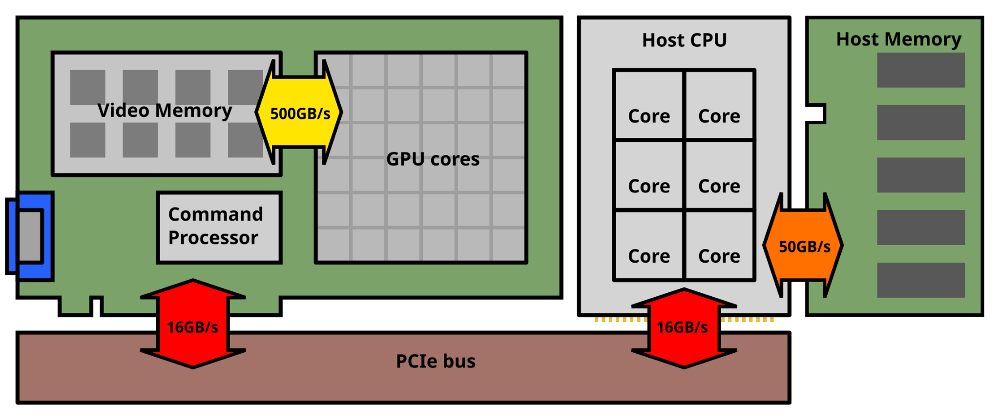

# Part 0: Motivation, Background and Setup

We will follow a different structure from other Vulkan tutorials, and a different approach too: we will not be writing bare Vulkan code directly, but instead rely on the [IMR](https://github.com/shady-gang/imr) framework, especially at first.
IMR is meant to hide a lot of the complexity of Vulkan so that the top-down approach makes sense.
The internals of IMR are meant to be transparent, and we will circle back to cover them later in the tutorial.

## Motivation

### Why computers are so damn parallel

Sometime near the early 2000s, computers hit a wall. A [Power wall](https://people.irisa.fr/Francois.Bodin/wp-content/uploads/2013/09/S01b-TGOC-PowerWall.pdf).

The short version is that making sequential computation faster by physically scaling processors down hit a physical limit, and so did our ability to increase clockspeeds.
From then on, making computers faster would involve a lot more work, and of interest to us, make the work the computers do more _parallel_.

By parallel work, we mean that the task can be split into sub-tasks that can be worked on independently. Adding two lists of numbers together is a parallel task: each addition is independent, and the results can be collected in an array without waiting on each other. Some algorithms are inherently iterative, such as finding [fixed points](https://en.wikipedia.org/wiki/Fixed-point_iteration), because they rely on previous results.

### Parallelism and computer graphics

Thankfully, computer graphics is a field that is full of parallelism, and therefore it's no surprise that graphics-specialized parallel processors have been so successful. It's often said that raytracing is "embarrassingly" parallel, because each pixel color is independent from its neighbors, and as such it's often used as the motivating example for parallel systems and techniques.

Other graphical workloads, like rasterization and image processing, also benefit from wide parallelism, even if it might not be as "trivial" as for ray-tracing. Realtime ray-tracing is, of course, perpetually 10 years in the future, which means that teaching rasterization is also perpetually clinging on to relevancy.

### GPUs and Vulkan

Either way, graphics workloads are exceptionally parallel, but also heavily bandwidth-intensive, which is why GPUs emerged as a dedicated piece of hardware to best service these workloads.
Programming them by hand would have been tedious, so high(er)-level programming interfaces, such as OpenGL, were used by programmers to express desired graphical operations, and the driver would interpret these into GPU commands on their behalf, in a portable way.

It turned out GPUs were actually good at many other non-graphics tasks, such as fluid simulation, cryptography or running artificial intelligence models.
Because those tasks are not inherently graphical, a different set of programming interfaces was required, and we got general-purpose GPU compute APIs, such as CUDA and OpenCL.

Vulkan is a newer API meant to succeed OpenGL, and has been very successful at fixing some of OpenGL's long standing issues. One of the objectives of Vulkan was to bring graphics and compute closer together, and while Vulkan is not as user-friendly as CUDA or OpenCL, it can be used to do both compute and graphics with a single technology.

For this reason, and because it is a cross-platform industry standard, we have decided to use Vulkan (in version 1.3) as our reference in this tutorial.
It must be said that the GPU concepts, whether in a graphics of compute API, are mostly the same no matter what abstraction you use, so this knowledge will be portable, although the jargon can be different elsewhere.

## Background

Graphics Processing Units (GPUs) are specialized processing units that are specialized to take care of graphical tasks on computers.
These days they're better characterized as tiny supercomputers that live in your computer.
This comparison makes more sense that it might sound like, because GPUs are:
 * Extremely fast due to comically large amounts of parallel processing ability
 * Programmed using specialized programming models
 * Relatively independent from the host system, fulfilling work in a batch-like system, much like an old mainframe with a human operator.


*Simplified system topology of a typical desktop computer in 2025*

There's a fascinating [history](23_history.md) to be told on how we got the GPUs we have, and it helps to know the broad strokes of it to understand many of the ... idiosyncrasies of modern GPUs and their programming models. For now though, your basic mental model should be that GPUs have _lots_ of cores, and that they run programs written in a special programming model.

These programs are not launched directly by the programmer, but instead a _command processor_ on the GPU is in charge of executing a stream of _commands_ that that set-up the GPU cores with the program, parameters, and how many _invocations_ (instances) of the program we want.
You may think of the command processor as a human operator, tending to the mainframe and feeding in punch cards with user programs on them.

## Setup

To follow this tutorial you will need a computer running a recent copy of Windows, MacOS or your favorite Linux distribution. You can either grab the [Vulkan SDK](https://www.lunarg.com/vulkan-sdk/) or install Vulkan-specific packages with your package manager of choice. If so, make sure you get tools such as `vulkaninfo`, `spirv-dis` and the vulkan validation layers.

For Windows users, we recommend [MSYS2/MinGW](https://www.msys2.org/). MSVC should work, but I don't actively test it. WSL is _not_ recommended because the virtualization layer means you're stuck with layered drivers such as `dzn`, which don't support modern Vulkan features, even if your hardware does!
This is not only wasteful for performance, but demands insane amounts of backwards-compatibility engineering work, which isn't educational or interesting.
Either use windows-native tools, or run linux on bare metal.

For Linux users, I don't care what distro you use, but I care that you know how to use their package manager, and their packages aren't years out of date, as the Vulkan ecosystem moves relatively quickly.
I'd advise against using the SDK tarball unless you know exactly what you're doing.

For MacOS users, make sure your version of MoltenVK supports 1.3.x.
If you're using Homebrew, this should be good.
Otherwise, you might need to build MoltenVK from source.

### Setup Instructions

Clone the IMR repo recursively:

```
git clone --recursive git@github.com:shady-gang/imr.git
```

And build the samples (13 for example):

```
cd imr
mkdir build
cd build
cmake .. # this will download some extra dependencies!
cmake --build .
./examples/13_compute_triangle/13_compute_triangle
```

You should see a red triangles. In a few moments you'll know how to make that happen yourself :)

---

[Next Section](11_pixels_on_screen.md)