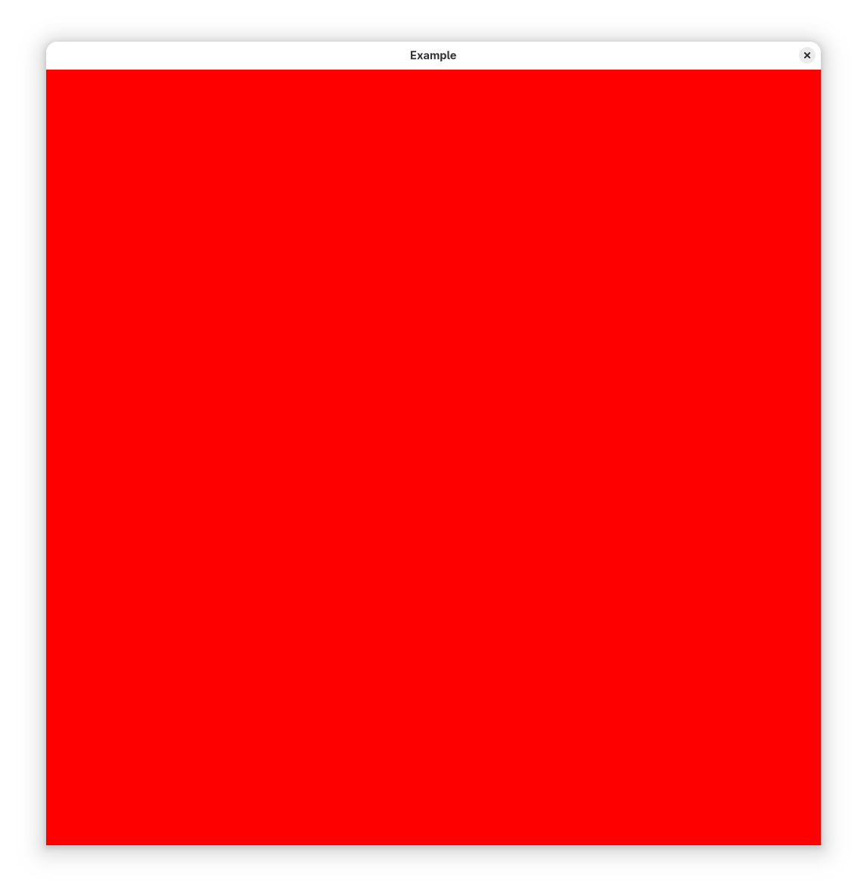

# Part 1.1: Getting pixels on the screen

*This corresponds to the sample [11_present_image](https://github.com/shady-gang/imr/tree/main/examples/11_present_image) in IMR*

The IMR framework makes use of [GLFW](https://www.glfw.org/) as the windowing library.
Since we're not abstracting over GLFW, we'll just use its functions directly.

We need to create a window, but as GLFW is usually used with OpenGL, we need to tell it not to create an OpenGL context before creating ours.

The `imr::Context` object initializes Vulkan for you and sets-up various sane defaults.
The `imr::Device` object represents your GPU. Vulkan can support an arbitrary number of GPUs, and you can have multiple applications sharing it at once.
The default constructor picks your "main" GPU for you, based on the context object.
We'll discuss the specifics of device initialization in more detail later, for now it doesn't matter, we just want to put something on screen!

To that end, we'll need one more thing: `imr::Swapchain` takes care of plugging Vulkan into our GLFW window.
Vulkan swapchain management is a particularly tricky aspect to get right, and a horrific thing to ask first-time users to understand before moving on.
You're welcome :)

We'll need a main loop, dealing with input events and closing the window on request. Our sample should look something like this:

```c++
#include "imr/imr.h"
#include "imr/util.h"

int main() {
    glfwInit();
    glfwWindowHint(GLFW_CLIENT_API, GLFW_NO_API);
    auto window = glfwCreateWindow(1024, 1024, "Example", nullptr, nullptr);

    imr::Context context;
    imr::Device device(context);
    imr::Swapchain swapchain(device, window);

    while (!glfwWindowShouldClose(window)) {
        ...
        glfwPollEvents();
    }

    return 0;
}
```

To compile this, just have a CMake target linking `imr`:

```cmake
add_executable(11_present_image 11_present_image.cpp)
target_link_libraries(11_present_image imr)
```

But actually, we're not done: we're not sending any images to the swapchain, so there's nothing to display.
Depending on your operating system and window manager, might be detected as our window not responding, or it might not show up at all. We need to put that swapchain object to use.

As alluded to earlier, swapchain management is a daunting task, and that's the case even with our simplified `imr::Swapchain` object.
Furthermore, to get anything out the screen we'll also need a bunch of extra per-frame objects, to record and submit commands for us.

Therefore we have an _extra simplified_ function in the swapchain that prepares everything for us.
That function takes a lambda function parameter, and it's in that function where we'll get to ask our GPU to do something, at last!

```c++
swapchain.renderFrameSimplified([&](imr::Swapchain::SimplifiedRenderContext& frame_context) {
    // Get the image and command buffer out of the context object
    imr::Image& image = frame_context.image();
    VkCommandBuffer cmdbuf = frame_context.cmdbuf();
});
```

The `SimplifiedRenderContext` object contains two things of use for us, a reference to an `imr::Image` and a _command buffer_.
The image object is a window-sized color image that we'll be rendering to define the window contents.
`imr::Image` is an abstraction over Vulkan's `VkImage` object and comes with various convenience features.
We can get the underlying `VkImage` by calling `imr::Image::handle()`.

The command buffer object is a Vulkan object used to record GPU commands.
The `renderFrameSimplified` helper function has already set up everything for us, so we can just record commands in the command buffer and those commands will "magically" execute after the lambda function returns.

Now is an exciting time, we're about to ask Vulkan to _do something_.
The simplest operation we can do to our image is to _clear_ it with a solid color.
The [`vkCmdClearColorImage`](https://registry.khronos.org/vulkan/specs/latest/man/html/vkCmdClearColorImage.html) command does exactly that, it takes 5 parameters (6 in practice):

 * What command buffer we're recording to (`cmdbuf`)
 * What image to operate on (`image.handle()`)
 * What _layout_ the image is in currently. This will be explained much later, but the framework guarantees it will be in `VK_IMAGE_LAYOUT_GENERAL` so just mindlessly put that in.
 * What color to clear the screen with. This is quite straightforward, but note the alpha component (transparency) set to one (opaque), and that it's passed by pointer.
 * What _image subresources_ we're clearing. We'll see later how images are sometimes really multiple images, but for now this doesn't matter. We want to clear the _whole image_. The last two parameters are a (count, ptr) list of subresource ranges.

```c++
VkClearColorValue red = { /* Red, Green, Blue, Alpha */ .float32 = { 1.0f, 0.0f, 0.0f, 1.0f}, };
VkImageSubresourceRange subresource_range = image.whole_image_subresource_range();
vkCmdClearColorImage(cmdbuf, 
    image.handle(),
    VK_IMAGE_LAYOUT_GENERAL,
    &red,
    1, &subresource_range);
```

And with that, we get a red window. Welcome to Vulkan.



[Previous Section](01_motivation.md) | [Next Section](12_compute_shadertoy.md)

## Exercises for the reader

 * Err ... make the screen green ? Or whatever your favorite color is.
 * Not really a lot more to this. Readers are however encouraged to take it slow, especially in the next section.

## Odds and ends

 * We haven't actually ran any code on the GPU. At least definitely not any code we wrote, depending on implementation details that clear command might just be a fancy `memset` !
 * The clear command takes exactly 4 components, always. This is one the many idiosyncrasies of graphics APIs: for historical reasons 4-component vectors come up a lot, and many image formats are 4-component.
 * With that said, there are 3, 2 and one-component images. In those cases, the extra components are ignored when clearing.
 * If you need more than 4 components, it's possible to render to multiple images.
 * The image and the clear command were _color_. There are other kinds of images as we'll see later.
