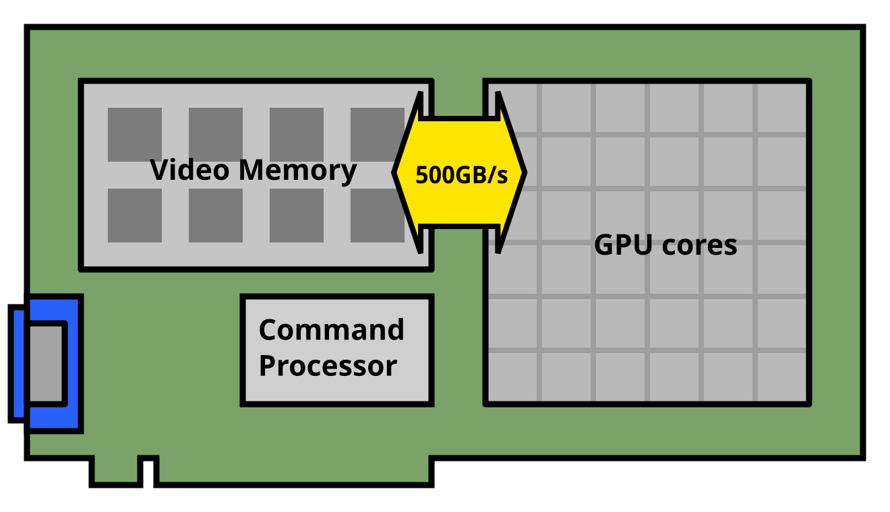
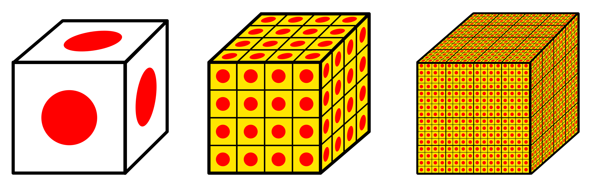
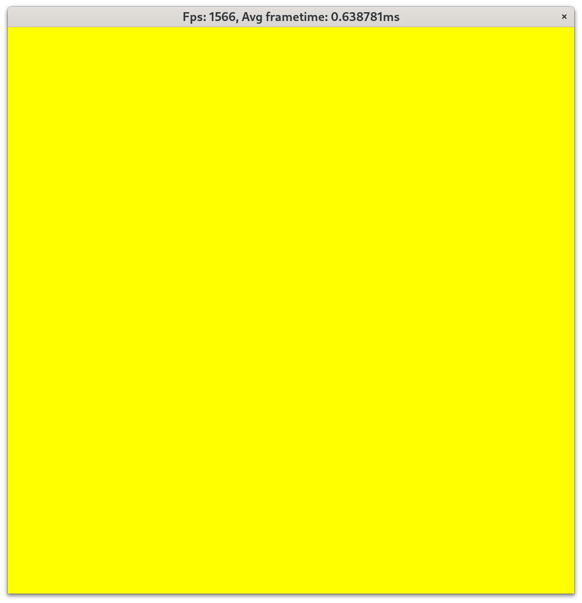
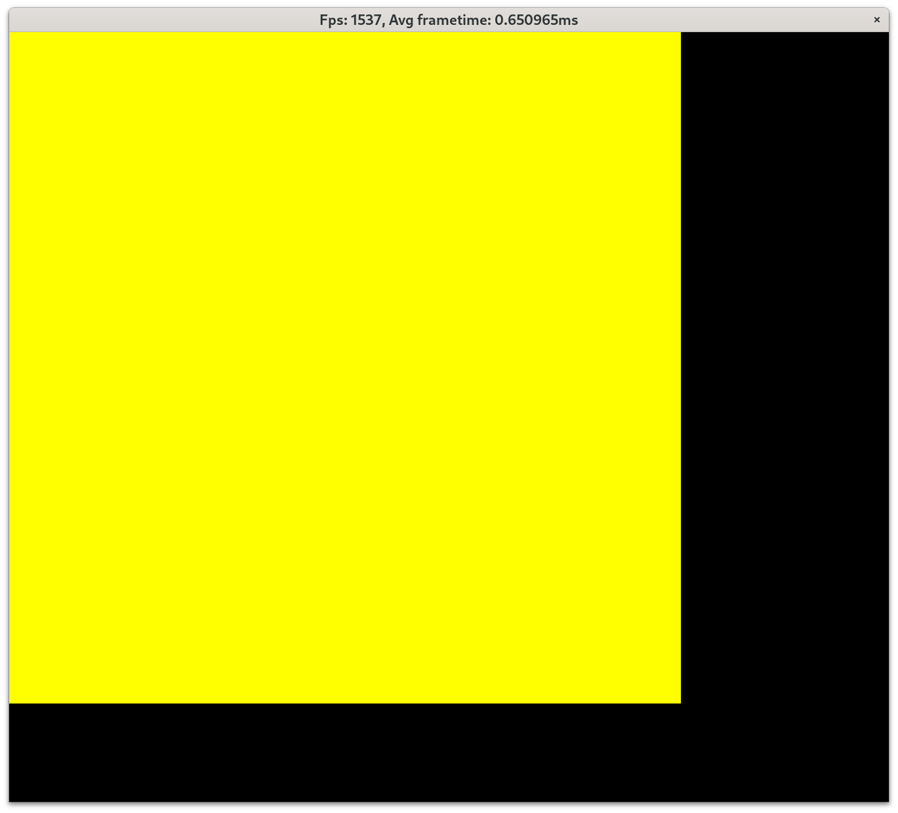
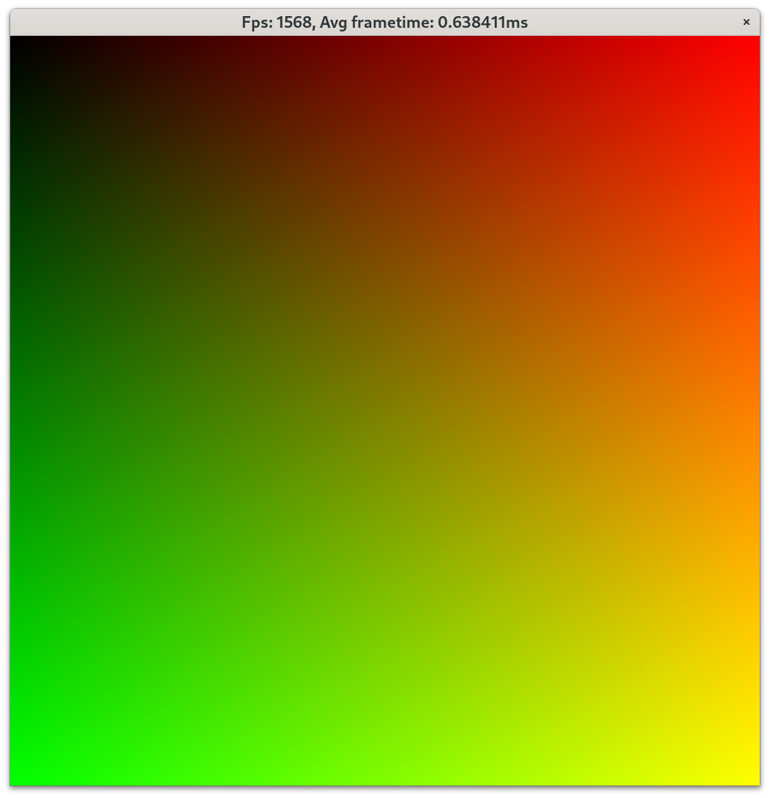

# 1.2: Running code for each pixel

One of the less daunting ways to approach realtime graphics is a neat website called [Shadertoy](https://www.shadertoy.com), where users can write small GPU programs that run in the browser and showcase cute, clever or mind-boggling effects.
In this section we're going to effectively create our own shaderoy, locally, with IMR and Vulkan.

But first, time to learn a whole new programming model!

## Intro to Compute Shaders

Compute Shaders are the simplest way to get your GPU cores to do something.
Let's recall the GPU diagram from earlier:



We have a large array of "GPU cores", not to scale because a modern GPU has _tens of thousands_ of those cores ! We're going to write a program that executes many, many times in parallel, in order to saturate (hopefully all) the cores with work.

Vulkan calls each such instance of a GPU program an _Invocation_.
The programming model of compute shaders is a two-level 3D grid: Invocations are assembled into a 3-dimensional _Workgroup_, and Vulkan _Dispatch Commands_ launches a 3D grid of workgroups.


*Left to right: one invocation, a workgroup (4x4x4 invocations), a dispatch (4x4x4 workgroups).*

In Vulkan, the size of a workgroup is decided by the program, but the size of the dispatch is decided by the [`vkCmdDispatch`](https://registry.khronos.org/vulkan/specs/latest/man/html/vkCmdDispatch.html) command.
But let's not get ahead of ourselves ...

One last thing: the 3D grid aspect can be ignored if our problem doesn't map well to it: we can simply decide to have AxBx1 2D grids, or even Ax1x1 1-D grids.
We do need to consider the workgroup size carefully, but for now we'll set it to 32x32, that value should work well for our purposes.

## How are GPU programs written ?

GPU programs are written from the perspective of a single invocation.
That is to say, the variables we declare and the values we compute are all going to be per-invocation.
Another way to think about it, is the shader code we'll write is the inside of a couple nested for loops:

```rust
for workgroup in dispatch {
    for invocation in workgroup {
        your_compute_shader();
    }
}
```

We're going to use a language called the OpenGL Shading Language (GLSL).
That language is superficially similar to C++, but without pointers, templates, lambdas and a whole bunch of things.
Anyway, we'll write an empty GLSL file:

```glsl
#version 450

// this line sets the workgroup size
layout(local_size_x = 32, local_size_y = 32, local_size_z = 1) in;

void main() {
    // do nothing
}
```

We compile it using CMake:

```cmake
find_program(GLSLANG_EXE glslang glslangValidator REQUIRED)

add_executable(12_compute_shader 12_compute_shader.cpp)
target_link_libraries(12_compute_shader imr)

add_custom_target(12_compute_shader_spv COMMAND ${GLSLANG_EXE} -V -S comp ${CMAKE_CURRENT_SOURCE_DIR}/12_compute_shader.glsl -o ${CMAKE_CURRENT_BINARY_DIR}/12_compute_shader.spv)
add_dependencies(12_compute_shader 12_compute_shader_spv)
```

We now have a `.spv` file.
We can use `spirv-val` to ensure the file is correctly formed, and `spirv-dis` to disassemble the file, to satisfy our curiosity.

## Running our Compute Shader

The `imr::ComputeShader` class assists with loading, configuring and launching compute shaders.
We just provide it the `.spv` file (relative to executable location):

```c++
imr::ComputeShader shader(device, "12_compute_shader.spv");
```

And inside our `renderFrameSimplified` lambda function, we can launch some invocations:

```c++
vkCmdBindPipeline(cmdbuf, VK_PIPELINE_BIND_POINT_COMPUTE, shader.pipeline());
vkCmdDispatch(cmdbuf, 32, 32, 1);
```

The first line tells the command buffer the next compute dispatches should be done with our `shader`.
The second line launches 32x32x1 workgroups.
Remember that we defined our workgroups to be 32x32 invocations, so we're actually launching (32*32)*(32*32) = 1048576 invocations !

Nothing happens yet, because the compute shader `main` function is empty.
To have something visible happen, we need to write our results out.

## Writing to the swapchain image from our Shader

Let's say we want to write the color yellow from our shader.
To do so, we can declare an `image2D` uniform variable in our GLSL shader:

```glsl
layout(set = 0, binding = 0)
uniform image2D renderTarget;
```

`uniform` variables define the "signature" of our shader: these variables are provided by the host application and are the same (uniform) for all invocations, hence the name.
The `layout(set = 0, binding = 0)` defines "where" that variable is in the interface of the shader.
The finer details of how those interfaces work will be explained later.

The `image2D` type defines a 2D image resource _descriptor_.
These are something like an opaque, implementation-defined pointer.
They don't contain the image but instead tell the shader where the image data is and how to access it.
We cannot dereference it like a pointer either, we need to use dedicated read/write functions that take 2D integer coordinates: [`imageLoad`](https://registry.khronos.org/OpenGL-Refpages/gl4/html/imageLoad.xhtml) and [`imageStore`](https://registry.khronos.org/OpenGL-Refpages/gl4/html/imageStore.xhtml).

```glsl
void main() {
    vec4 yellow = vec4(1, 1, 0, 1);
    ivec2 coords = ivec2(gl_GlobalInvocationID.xy);
    imageStore(renderTarget, coords, yellow);
}
```

Above is a main function that writes the color yellow.
The color we're going to write to the image is defined as a `vec4` (four-component vector of floats).

`gl_GlobalInvocationID` is a special built-in variable that contains a `uvec3` value (three-component vector of unsigned integers).
As you can guess, that value contains the location of the invocation in the aforementioned 3D grid.

We only care about the first two components though, which we can extract with the `.xy` swizzle operator.
Swizzle operators allow extracting one to four components from a vector, in any arbitrary order: `.yx`, `.xx` or even `.zzxy` would also be valid swizzles.
See [GLSL docs](https://www.khronos.org/opengl/wiki/Data_Type_(GLSL)#Swizzling) for more.

One last detail is that `imageStore` wants an `ivec2` (signed) instead of an `uvec2`, so we cast the value using the `ivec2` constructor.



Very impressive... but we're not quite done.
Try resizing the window:



We need to do two things to handle resizing correctly.
On the host, we need to launch enough workgroups to fill the window, rounding up because we cannot launch partial workgroups:

```cpp
vkCmdDispatch(cmdbuf, (image.size().width + 31) / 32, (image.size().height + 31) / 32, 1);
```

If the window size is not a multiple of 32, we should also avoid writing out-of-bounds to the image.
We can actually query the image size from the `image2D` variable directly:

```glsl
ivec2 img_size = imageSize(renderTarget);
if (gl_GlobalInvocationID.x >= img_size.x || gl_GlobalInvocationID.y >= img_size.y)
    return;
```

This all-yellow screen is not particularly interesting.
We can modify the shader to display something more interesting, we can do a gradient by mapping the normalized X and Y positions to the red and green components:

```glsl
void main() {
    ivec2 img_size = imageSize(renderTarget);
    if (gl_GlobalInvocationID.x >= img_size.x || gl_GlobalInvocationID.y >= img_size.y)
        return;

    ivec2 coords = ivec2(gl_GlobalInvocationID.xy);
    vec4 color = vec4(0, 0, 0, 1);
    // make sure to convert to float since the target range is [0.0, 1.0]
    color.xy = vec2(gl_GlobalInvocationID.xy) / vec2(img_size);
    imageStore(renderTarget, coords, color);
}
```



That was a lot to take in, but we made it.
We can write prettymuch anything we want in our `main` function.
If you check out [Shadertoy](https://www.shadertoy.com), you'll find that people write entire raytracers in a shader!
We're going to use compute shaders to draw some triangles next time.
In the meantime, consider trying some of the reader exercises down below.

[Previous Section](11_pixels_on_screen.md) | [Next Section](13_triangle.md)

## Odds and ends

 * Unlike other APIs, Vulkan actually doesn't come with a language to write GPU code in. 
Instead, Vulkan uses SPIR-V, an intermediate program representation that can be produced by a variety of languages.
In other words, you get a choice here, though we chose GLSL for the tutorial.
 * 